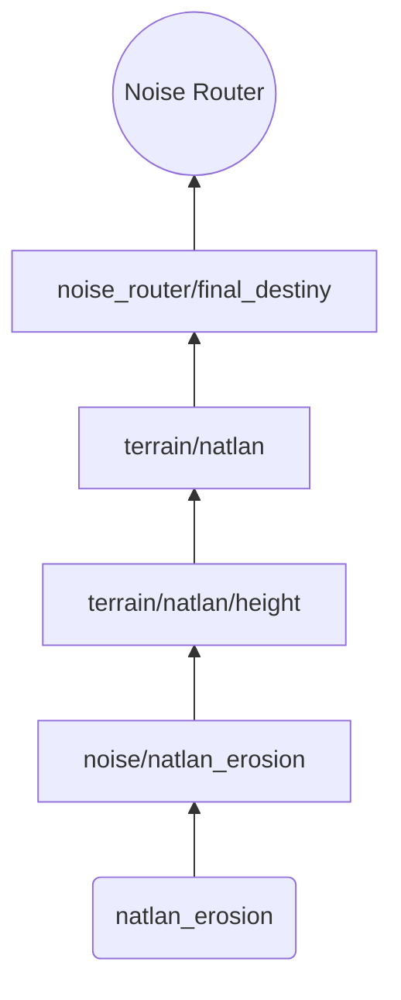

- Density Functions
  - `source/`: 2D-Maps
  - `noise_router/`: Fertige DFs für den Noise Router

1. Land oder Meer? -> DF für Land-Terrain bzw. DF für Meeres-Terrain
2. Terrainart bestimmen -> DF für bestimmte Terrainart; weitläufig verblenden
3. Terrain bauen, aus beliebigen Heightmaps und anderen DF (z.B. Arcs)

## Density

